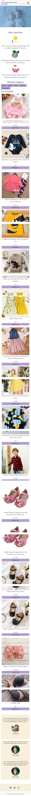
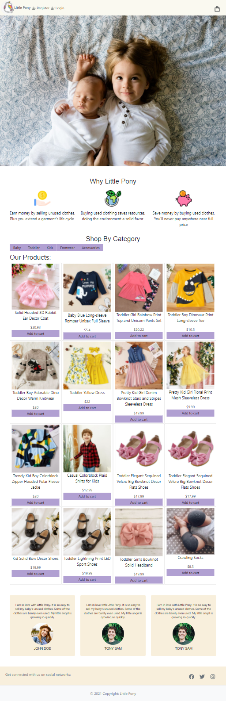

# Little Pony

### Table of Contents

- [Description](#description)
- [Installation](#installation)
- [Usage](#usage)
- [Contribution](#contribution)
- [License](#license)

## Description

Little Pony is an ecommerce website for buying and selling used baby clothes and accessories.

The user can do the following:

- Buy products

- Add products for selling

- Payment is done via Stripe

## Mock up

- The following image shows the website in different devices

## Desktop

## Iphone X

## Ipad Pro

## Installation

- Clone repository.
- `npm install`
- `node server.js`
- `npm run seed` - to get seed datas.

## Usage

The application is available [here](http://fierce-basin-74798.herokuapp.com/)

## Contribution

Please feel free in making contribution to this repository. But please first discuss the change via email with me. I will try to get back to you as soon as possible.

## Questions

If you have any questions feel free to contact me:

Github Username: sona29

Email: sona.shrestha004@gmail.com

## License

